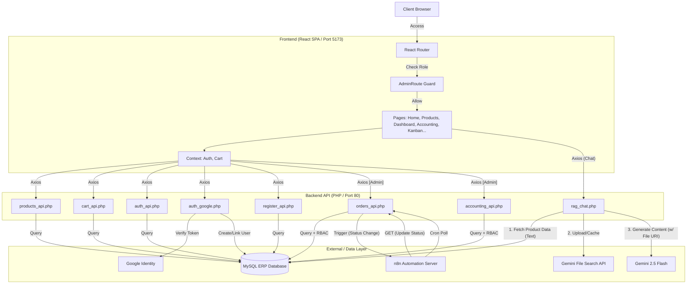

# 專案分析報告: 109022005bootstrap

## 🚀 主要開發環境 (Active Development)
**資料夾位置**: [`main_app/`](main_app/)

這是目前的**核心開發目錄**，整合了網站的主要功能與常用的 Bootstrap 範本。所有的開發工作應盡量在此資料夾中進行。

### `main_app` 結構說明:
*   **根目錄結構**:
    *   `client/`: React 前端專案原始碼 (Vite + React)。
    *   `api/`: 後端 PHP API 服務核心 (RESTful)。
    *   `index.html`: 應用程式入口 (SPA Entry Point)。
    *   `n8n_autoship.json`: n8n 自動化部署檔。
    *   `database_schema.sql`: 資料庫初始化腳本。
    *   `manifest.webmanifest`, `sw.js`: PWA 配置檔。
*   **核心資源**:
    *   `api/`: 後端 PHP/SQL 支援。
    *   `assets/`: 共用 Bootstrap 資源 (CSS/JS)。
    *   `css/`, `js/`: 專案專屬樣式與腳本。
*   **📂 `examples/` (範本集)**:
    *   包含所有已整合的 Bootstrap 範本，如：
        *   `dashboard/`, `starter-template/`
        *   `blog/`, `carousel/`, `pricing/`, `features/`
        *   `headers/`, `footers/`, `navbars/`, `sidebars/`
        *   `sign-in/`, `checkout/`, `grid/`, `modals/`

---

## 專案結構概觀

此專案設定在 XAMPP 環境 (`d:\xampp\htdocs\109022005bootstrap`)，包含多個獨立的 Bootstrap 範例。

### 1. 獨立全端模組
以下模組保留在根目錄，可作為獨立參考：

*   **[`album/`](album/)**: 相簿展示功能 (已簡化，移除了與商店相關的 `cart` 等檔案)。
*   **[`shop/`](shop/)**: 完整的電商範例 (包含獨立的 SQL 與完整頁面)。

### 2. 其他 Bootstrap 範例
根目錄下仍保留部分未整合的 Bootstrap 元件範例，例如：
*   `assets/`, `badges/`, `buttons/`
*   `dropdowns/`, `heroes/`, `jumbotron/`
*   `list-groups/`, `masonry/`, `offcanvas/`
*   `navbar-fixed/`, `navbar-static/`, `sticky-footer/`

---

## 開發建議
1.  **資料庫**: 請使用 `main_app/database_schema.sql` 於 phpMyAdmin 建立資料庫。
2.  **伺服器**: 啟動 Apache 與 MySQL 後，存取 `http://localhost/109022005bootstrap/main_app/` 查看整合後的成果。

---

---

## 🚀 快速部署指南 (Quick Deployment)

如果您要在新環境部署此專案，請遵循以下步驟：

### 1. 環境需求
- **XAMPP** (含 Apache & MySQL)
- **Git**
- **Node.js** (v18.0+)

### 2. 複製專案 (Clone)
在 XAMPP 的 `htdocs` 目錄下執行：
```bash
cd C:\xampp\htdocs
git clone https://github.com/bkttt0429/web_project.git 109022005bootstrap
```

### 3. 資料庫匯入
1. 前往 `http://localhost/phpmyadmin/`。
2. 建立新資料庫 **`shop_db`**。
3. 匯入專案檔案：`main_app/api/database_schema.sql`。

### 4. 運行與開發
- **生產環境**: 存取 `http://localhost/109022005bootstrap/main_app/client/dist/`。
- **前端開發**:
  ```bash
  cd 109022005bootstrap/main_app/client
  npm install
  npm run dev
  ```
  存取 `http://localhost:5173`。

---

# 開發日誌 (Development Log) - Bootstrap ERP 系統

**日期**: 2025-12-12
**版本**: v2.0.0 (React Migration)
**開發者**: Antigravity (AI Assistant)

## 1. 系統架構重構 (React + Web API)

為順應現代化前端開發趨勢，本階段將原有 `Mixed PHP` 架構升級為 `前後端分離` 架構。

### A. 後端 API 層 (PHP JSON API)
將核心邏輯封裝為純 JSON 介面，供前端呼叫：
-   `api/products_api.php`: 提供商品列表查詢，支援 GET。
-   `api/cart_api.php`: 提供 Session 購物車狀態管理，支援 GET(查詢) 與 POST(新增/移除)。
-   `api/auth_api.php`: 提供管理員登入驗證與狀態檢查。
-   `api/rag_chat.php`: (既有) 提供 RAG AI 對話服務。

### B. 前端應用層 (React + Vite)
於 `main_app/client` 建立基於 Vite 的 React 單頁應用 (SPA)：
-   **技術棧**: React 18, React Router v6, Bootstrap 5 (React-Bootstrap), Axios。
-   **路由結構**:
    -   `/`: 首頁 (Home)，展示系統特色。
    -   `/products`: 商品目錄，網格化展示與加入購物車功能。
    -   `/cart`: 購物車頁面，動態計算總金額。
    -   `/signin`: 管理員登入頁。
    -   `/dashboard`: **ERP 後台智慧助理**，整合 RAG Chat Widget。
-   **狀態管理**: 使用 Context API (`AuthContext`, `CartContext`) 實現全站狀態共享。

## 2. RAG AI 整合升級
-   前端透過 `Dashboard.jsx` 介面，以非同步方式呼叫後端 `rag_chat.php`。
-   支援即時對話顯示與 Debug 資訊查看。
-   使用 `Standard SQL Retrieval` 策略確保資料準確性。

## 3. 系統架構圖 (Updated for v2.6)



## 4. 部署說明
1.  **開發模式**:
    ```bash
    cd main_app/client
    npm run dev
    ```
    (存取 `http://localhost:5173`)

2.  **生產環境 (XAMPP)**:
    -   運行 `npm run build`。
    -   將 `dist/` 內容部署至 `main_app/` 資料夾。
    -   存取 `http://localhost/109022005bootstrap/main_app/`。

## 5. 預設測試帳號 (Default Credentials)
-   **Email**: `admin@example.com`
-   **Password**: `admin`

## [v2.2.0] - 2025-12-12 - 進階函式庫實作 (Advanced Libraries Implementation)
**目標**: 使用 React 推薦函式庫，優化 UI/UX 與開發者體驗。

### 新增功能與優化:
1.  **狀態管理與資料獲取 (React Query)**
    -   導入 `@tanstack/react-query` 進行伺服器狀態管理。
    -   重構 `Overview.jsx`，使用 `useQuery` 取代手動 `useEffect` 與 Loading 狀態。
    -   啟用後台自動重新整理 (每 30 秒)，實現儀表板即時數據更新。

2.  **表單驗證 (React Hook Form)**
    -   重構 `AdminProducts.jsx` 的新增/編輯視窗，採用 `react-hook-form`。
    -   實作完整的表單驗證 (必填欄位、數值範圍)，並提供即時錯誤提示。
    -   簡化表單狀態管理，移除複雜的手動 State 物件。

3.  **資料表格 (AG Grid)**
    -   將 `AdminOrders.jsx` 的傳統 Bootstrap 表格替換為 `ag-grid-react`。
    -   開箱即用支援排序、篩選與分頁功能。
    -   新增 `api/orders_api.php` 提供真實訂單資料給 AG Grid 使用。

4.  **看板管理 (React DnD)**
    -   建立 `OrderKanban.jsx`，使用 `react-dnd` 與 `react-dnd-html5-backend`。
    -   實作拖放介面，管理訂單狀態流程 (待處理 -> 處理中 -> 已完成)。
    -   串接後端 API 實現狀態即時更新。
    -   **(v2.7 新增)**: 支援前端自動輪詢 (Polling)，即時反映 n8n 自動化處理的結果。

5.  **互動式 UI (Swiper.js)**
    -   建立 `ProductDetailsModal.jsx`，導入 `swiper/react`。
    -   實作 "Coverflow" 3D 圖片輪播效果。
    -   整合至 `Products.jsx`，點擊商品卡片即可開啟互動視窗。

---

## 🛠️ 核心基礎設施優化 (Core Infrastructure Optimization)

### 1. RESTful API 重構與 CORS 優化
- **API 模組化與統一引導 (API Boostrapping)**:
  - 建立 `api_bootstrap.php` 作為全站 API 的統一入口點。
  - **集中化管理**: 統一處理 CORS、Session 啟動、資料庫連線與 JWT 常式庫載入。
  - **通用工具函式**: 實作 `sendResponse()` (標準 JSON 輸出) 與 `getJsonInput()` (自動解析 Request Body)，減少各 API 檔案重複代碼並大幅提升穩定性。
- **CORS 核心修正**:
  - 全面啟用 `Access-Control-Allow-Origin` 動態來源偵測。
  - 支援 `Access-Control-Allow-Credentials: true` 以允許 Session Cookie 跨域傳遞。
  - 補完 `Access-Control-Allow-Headers`，新增 `Authorization` 支援 JWT 驗證。
  - 修正 `OPTIONS` Preflight 請求的正確響應 (HTTP 200)。
- **Google 第三方登入強化**:
  - 重構 `auth_google.php`，修正 SSL 憑證驗證問題 (Dev 環境)。
  - 登入成功後同步回傳 JWT Token，確保與原生登入機制的 Session 狀態一致。

### 2. 前端路由與 API 配置標準化
- **動態 API 路徑偵測**:
  - 重構 `apiConfig.js`，自動計算 XAMPP 子目錄與 API 路徑，解決 SPA 在不同網址層級下的 404 問題。
- **全域 Axios 配置**:
  - 在 `AuthContext` 啟用全域 `withCredentials: true`，解決跨域 Session 遺失問題。

---

### 驗證步驟 (Verification)
1.  **儀表板 (Dashboard)**: 存取 `http://localhost/109022005bootstrap/main_app/#/dashboard`。確認統計數據立即載入且無延遲。
2.  **商品管理 (Products)**: 前往 `http://localhost/109022005bootstrap/main_app/#/dashboard/products`。點擊 "新增商品" 並嘗試提交庫存，確認出現驗證錯誤提示。
3.  **訂單管理 (Orders)**: 前往 `http://localhost/109022005bootstrap/main_app/#/dashboard/orders`。點擊欄位標題進行排序，並測試篩選功能。
4.  **看板管理 (Kanban)**: 前往 `http://localhost/109022005bootstrap/main_app/#/dashboard/kanban`。將一張訂單從 "Pending" 拉動至 "Processing"，確認狀態更新。
5.  **前台商店 (Shop)**: 前往 `http://localhost/109022005bootstrap/main_app/#/products`。點擊任一商品卡片，確認彈出 Swiper 圖片輪播視窗。

---

### v2.3.0 - 用戶註冊與大規模模擬 (User Registration & Massive Simulation)
- **新增功能 (New Features)**:
  - 實作 **用戶註冊 (User Registration)**:
    - 前端: 新增 `SignUp.jsx` (React Hook Form + Axios)。
    - 後端: 新增 `api/register_api.php`，包含 Email 重複檢查與密碼加密 (bcrypt)。
  - **大規模數據模擬 (Massive Data Simulation)**:
    - 升級 `seed_data.php`: 自動生成 50 位用戶、50 項隨機商品。
    - 實作 `simulate_transactions.php`:
      - 模擬所有用戶的消費行為。
      - 生成 137+ 筆歷史訂單，分佈於過去 90 天。
      - 包含多種訂單狀態 (Completed, Processing, Cancelled)。

### v2.4.0 - 智能推薦系統與視覺優化 (Recommendation System)
- **新增功能 (New Features)**:
  - **智能推薦系統 (Smart Recommendations)**:
    - 後端 (`api/recommendations.php`):
      - **個人化推薦**: 分析用戶歷史訂單，找出「最常購買類別」，推薦同類別但未購買過的商品。
      - **熱銷推薦 (Fallback)**: 若用戶未登入或無歷史記錄，自動顯示全站熱銷商品 (Top Selling)。
    - 前端 (`RecommendedProducts.jsx`):
      - 使用 React Query 進行數據獲取與緩存.
      - 整合至首頁 (`Home.jsx`)，登入前後顯示不同推薦內容。
  - **視覺優化 (Visual Enhancement)**:
    - 更新全站 50 項商品的圖片，改用 Picsum 高畫質隨機圖庫 (`simulate_images.php`)，提升展示真實感。
    - 優化首頁佈局，加入推薦商品區塊與動畫效果 (Framer Motion)。

### v2.6.0 - 企業級架構重構與演算法升級 (Enterprise Architecture & Algorithms)
**日期**: 2025-12-30
**核心變更**: 從輕量級應用轉型為企業級 ERP 系統架構。

#### 1. 資料庫遷移 (PostgreSQL Migration)
- **架構升級**: 將原有的 MySQL 架構完整遷移至 **PostgreSQL 15** (Dockerized)。
- **Schema 優化**:
    - 全面導入 `TIMESTAMP DEFAULT CURRENT_TIMESTAMP` 與 `TRIGGER` 自動更新機制。
    - 針對 `orders` 表新增 `shipping_address` (TEXT) 與 `phone` (VARCHAR) 欄位，支援更完整的物流資訊。
    - 重構 SQL 查詢語法以符合標準 SQL (Standard SQL) 規範 (移除 MySQL 特有的 `GROUP BY` 寬鬆檢查)。

#### 2. ERP 核心演算法實作 (Core Algorithms)
為了讓系統具備「決策能力」，我們引入了多種演算法邏輯：
- **AI 優先級評分 (Priority Scoring)**:
    - 實作於 `orders_api.php`。
    - **公式**: `(訂單金額 / 1000) + (等待時間 * 5)`。
    - **效益**: 自動平衡「高價值客戶優先」與「FIFO 公平性」，解決單純依賴時間排序的無效率問題。
- **全狀態訂單模擬**:
    - 升級 `seed_data.php`，生成 **100 筆** 包含真實台灣地址 (TW Addresses) 與電話的模擬資料。
    - 確保 `Pending / Processing / Completed / Cancelled` 四種狀態均勻分佈，以測試看板與列表的負載能力。

#### 3. 介面與體驗優化 (UI/UX)
- **訂單管理 (AdminOrders)**:
    - 新增 **AI 優先級** 欄位 (附帶 🪄 魔法棒圖示)，視覺化呈現演算法結果。
    - 實作 **訂單詳情彈窗 (Modal)**，直接展示收件人姓名、電話、地址與詳細商品清單。
    - 加入 **一鍵出貨/完成** 按鈕，與後端狀態機連動，自動鎖定不合法的操作 (如：已完成訂單不可再出貨)。
    - **UI 動畫通知 (v2.7)**: 整合 `react-hot-toast` 與輪詢機制，當訂單狀態被外部更新時，自動彈出出貨通知卡片。
- **看板管理 (Kanban)**:
    - 訂單卡片同步顯示 **AI 優先級分數**，協助倉儲人員判斷處理順序。
    - 修復拖曳更新時的狀態同步問題。

### v2.7.0 - 自動化物流與即時監控 (Automation & Real-time Monitoring)
**日期**: 2025-12-31
**核心變更**: 引入 n8n 自動化工作流，實現「已付款 -> 已出貨」的無人化處理，並優化前端即時性。

#### 1. n8n 自動化工作流 (Logistics Automation)
- **雙觸發機制 (Dual Trigger)**:
    - **Webhook (即時)**: 當訂單狀態變更為 "Paid" 時，PHP 後端立即觸發 Webhook，n8n 接收後直接執行出貨邏輯。
    - **Cron Job (排程)**: 每 5 分鐘掃描一次 "Paid" 訂單 (防止 Webhook 丟失)，進行批量補漏出貨。
- **V16 穩定版架構**:
    - 使用 **Classic Expression (`={{...}}`)** 建構 GET 請求，確保 URL 與參數 (api_key, action, id) 正確編碼與傳遞。
    - 解決了早期版本 (V13/V14) 因 URL 解析錯誤導致的執行失敗問題。

#### 2. API 安全與邏輯升級
- **Query Parameter 驗證**:
    - `admin_gate.php` 支援 `api_key` 透過 URL Query String 傳遞 (解決部分伺服器過濾 Header 問題)。
- **GET 更新邏輯**:
    - `orders_api.php` 邏輯重構，允許 **GET 請求** 攜帶 `action=update_status` 參數來觸發狀態更新 (原僅支援 POST)。

#### 3. 前端即時感知 (Real-time UX)
- **自動輪詢 (Auto-Polling)**:
    - `AdminOrders.jsx` 實作 `setInterval` (5秒)，自動同步後端最新狀態。
    - 配合 `useRef` 追蹤狀態變化，當訂單從 "Paid" 轉為 "Shipped" 時，觸發 **Toast UI 動畫** 通知管理員。
