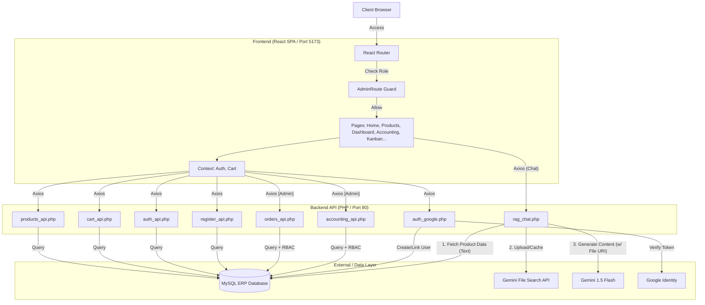

# 開發日誌 (Development Log) - Bootstrap ERP 系統

**日期**: 2025-12-12
**版本**: v2.0.0 (React Migration)
**開發者**: Antigravity (AI Assistant)

## 1. 系統架構重構 (React + Web API)

為順應現代化前端開發趨勢，本階段將原有 `Mixed PHP` 架構升級為 `前後端分離` 架構。

### A. 後端 API 層 (PHP JSON API)
將核心邏輯封裝為純 JSON 介面，供前端呼叫：
-   `api/products_api.php`: 提供商品列表查詢，支援 GET。
-   `api/cart_api.php`: 提供 Session 購物車狀態管理，支援 GET(查詢) 與 POST(新增/移除)。
-   `api/auth_api.php`: 提供管理員登入驗證與狀態檢查。
-   `api/rag_chat.php`: (既有) 提供 RAG AI 對話服務。

### B. 前端應用層 (React + Vite)
於 `main_app/client` 建立基於 Vite 的 React 單頁應用 (SPA)：
-   **技術棧**: React 18, React Router v6, Bootstrap 5 (React-Bootstrap), Axios。
-   **路由結構**:
    -   `/`: 首頁 (Home)，展示系統特色。
    -   `/products`: 商品目錄，網格化展示與加入購物車功能。
    -   `/cart`: 購物車頁面，動態計算總金額。
    -   `/signin`: 管理員登入頁。
    -   `/dashboard`: **ERP 後台智慧助理**，整合 RAG Chat Widget。
-   **狀態管理**: 使用 Context API (`AuthContext`, `CartContext`) 實現全站狀態共享。

## 2. RAG AI 整合升級
-   前端透過 `Dashboard.jsx` 介面，以非同步方式呼叫後端 `rag_chat.php`。
-   支援即時對話顯示與 Debug 資訊查看。
-   使用 `Standard SQL Retrieval` 策略確保資料準確性。

## 3. 系統架構圖 (Updated for v2.6)



## 4. 部署說明
1.  **開發模式**:
    ```bash
    cd main_app/client
    npm run dev
    ```
    (存取 `http://localhost:5173`)

2.  **生產環境 (XAMPP)**:
    -   運行 `npm run build`。
    -   將 `dist/` 內容部署至 `main_app/` 資料夾。
    -   存取 `http://localhost/109022005bootstrap/main_app/`。

## 5. 預設測試帳號 (Default Credentials)
-   **Email**: `admin@example.com`
-   **Password**: `admin`

## [v2.2.0] - 2025-12-12 - 進階函式庫實作 (Advanced Libraries Implementation)
**目標**: 使用 React 推薦函式庫，優化 UI/UX 與開發者體驗。

### 新增功能與優化:
1.  **狀態管理與資料獲取 (React Query)**
    -   導入 `@tanstack/react-query` 進行伺服器狀態管理。
    -   重構 `Overview.jsx`，使用 `useQuery` 取代手動 `useEffect` 與 Loading 狀態。
    -   啟用後台自動重新整理 (每 30 秒)，實現儀表板即時數據更新。

2.  **表單驗證 (React Hook Form)**
    -   重構 `AdminProducts.jsx` 的新增/編輯視窗，採用 `react-hook-form`。
    -   實作完整的表單驗證 (必填欄位、數值範圍)，並提供即時錯誤提示。
    -   簡化表單狀態管理，移除複雜的手動 State 物件。

3.  **資料表格 (AG Grid)**
    -   將 `AdminOrders.jsx` 的傳統 Bootstrap 表格替換為 `ag-grid-react`。
    -   開箱即用支援排序、篩選與分頁功能。
    -   新增 `api/orders_api.php` 提供真實訂單資料給 AG Grid 使用。

4.  **看板管理 (React DnD)**
    -   建立 `OrderKanban.jsx`，使用 `react-dnd` 與 `react-dnd-html5-backend`。
    -   實作拖放介面，管理訂單狀態流程 (待處理 -> 處理中 -> 已完成)。
    -   串接後端 API 實現狀態即時更新。

5.  **互動式 UI (Swiper.js)**
    -   建立 `ProductDetailsModal.jsx`，導入 `swiper/react`。
    -   實作 "Coverflow" 3D 圖片輪播效果。
    -   整合至 `Products.jsx`，點擊商品卡片即可開啟互動視窗。

### 驗證步驟 (Verification)
1.  **儀表板 (Dashboard)**: 存取 `http://localhost/109022005bootstrap/main_app/#/dashboard`。確認統計數據立即載入且無延遲。
2.  **商品管理 (Products)**: 前往 `http://localhost/109022005bootstrap/main_app/#/dashboard/products`。點擊 "新增商品" 並嘗試提交空白表單，確認出現驗證錯誤提示。
3.  **訂單管理 (Orders)**: 前往 `http://localhost/109022005bootstrap/main_app/#/dashboard/orders`。點擊欄位標題進行排序，並測試篩選功能。
4.  **看板管理 (Kanban)**: 前往 `http://localhost/109022005bootstrap/main_app/#/dashboard/kanban`。將一張訂單從 "Pending" 拉動至 "Processing"，確認狀態更新。
5.  **前台商店 (Shop)**: 前往 `http://localhost/109022005bootstrap/main_app/#/products`。點擊任一商品卡片，確認彈出 Swiper 圖片輪播視窗。

### v2.3.0 - 用戶註冊與大規模模擬 (User Registration & Massive Simulation)
- **新增功能 (New Features)**:
  - 實作 **用戶註冊 (User Registration)**:
    - 前端: 新增 `SignUp.jsx` (React Hook Form + Axios)。
    - 後端: 新增 `api/register_api.php`，包含 Email 重複檢查與密碼加密 (bcrypt)。
  - **大規模數據模擬 (Massive Data Simulation)**:
    - 升級 `seed_data.php`: 自動生成 50 位用戶、50 項隨機商品。
    - 實作 `simulate_transactions.php`:
      - 模擬所有用戶的消費行為。
      - 生成 137+ 筆歷史訂單，分佈於過去 90 天。
      - 包含多種訂單狀態 (Completed, Processing, Cancelled)。

### v2.4.0 - 智能推薦系統與視覺優化 (Recommendation System)
- **新增功能 (New Features)**:
  - **智能推薦系統 (Smart Recommendations)**:
    - 後端 (`api/recommendations.php`):
      - **個人化推薦**: 分析用戶歷史訂單，找出「最常購買類別」，推薦同類別但未購買過的商品。
      - **熱銷推薦 (Fallback)**: 若用戶未登入或無歷史記錄，自動顯示全站熱銷商品 (Top Selling)。
    - 前端 (`RecommendedProducts.jsx`):
      - 使用 React Query 進行數據獲取與緩存。
      - 整合至首頁 (`Home.jsx`)，登入前後顯示不同推薦內容。
  - **視覺優化 (Visual Enhancement)**:
    - 更新全站 50 項商品的圖片，改用 Picsum 高畫質隨機圖庫 (`simulate_images.php`)，提升展示真實感。
    - 優化首頁佈局，加入推薦商品區塊與動畫效果 (Framer Motion)。

### 驗證步驟 (Verification Steps)
1. **註冊功能**:
   - 前往 `#/signup` 建立新帳號，確認可成功跳轉至登入頁。
2. **數據模擬**:
   - 登入後台 `#/dashboard`，確認顯示大量歷史訂單與銷售數據圖表。
3. **推薦系統**:
   - **未登入**: 首頁顯示「熱銷推薦」。
### v2.5.0 - RAG 升級與社交登入整合 (RAG 2.0 & Social Login)
- **RAG AI 升級 (RAG 2.0)**:
  - **Gemini File Search API**:
    - 棄用 SQL-based RAG，改用 Gemini 原生 File API 進行文檔檢索。
    - 實作 `getProductDataAsText` 將 ERP 產品數據轉為結構化文本。
    - 實作 `uploadToGemini` 支援 Resumable Upload 與快取機制 (`gemini_file_store.json`)，效能提升且減少 Token 消耗。
  - **視覺化回答 (Chart Visualization)**:
    - 後端 (`rag_chat.php`): 優化 Prompt，指示 AI 輸出 `<data>` JSON 格式數據。
    - 前端 (`AdminChat.jsx`): 整合 `Recharts`，自動偵測並將數據繪製成互動式長條圖。

- **認證系統增強 (Auth Enhancement)**:
  - **Google 社交登入 (Social Login)**:
    - 資料庫擴充 (`users` table): 新增 `google_id`, `avatar_url`。
    - 後端 (`auth_google.php`): 實作 Google ID Token 驗證與自動註冊/連結帳號邏輯。
    - 前端: 整合 `@react-oauth/google`，於登入頁新增 "Sign in with Google"。
  - **註冊流程優化**:
    - 於登入頁 (`SignIn.jsx`) 新增註冊引導連結，串接既有註冊 API。

- **UI/UX 優化**:
  - **商品頁佈局**: 將「熱銷商品」與「為您推薦」區塊移至商品列表最上方，提升轉換率。
  - **Bug 修復**: 修正推薦元件中無用戶名顯示 `undefined` 的問題 (Fallback to 'Valued Customer')。

### 驗證步驟 (Verification Steps)
1. **RAG 視覺化**: 進入後台 Chat，詢問「庫存最多的前 5 項商品」，確認出現長條圖。
2. **Google 登入**: 登出後，使用 Google 帳號登入系統，確認自動創建帳號並導向 Dashboard。
3. **商品推薦**: 進入商品頁，確認推薦區塊位於最上方且標題顯示正常。

### v2.6.0 - PWA, RBAC & 財務系統整合 (PWA, RBAC & Financial System)
**目標**: 強化系統安全性、行動端體驗與企業級財務管理能力。

- **PWA (Progressive Web App)**:
  - 整合 `vite-plugin-pwa` 實現 Service Worker 自動更新。
  - 配置 `manifest.json` 與圖標，支援「安裝」至手機或電腦桌面。
  - (註: 生產環境部署時暫時停用以優化建置流程，架構已就緒)。

- **RBAC (角色權限控制)**:
  - **資料庫擴充**: `users` 表新增 `role` 欄位 (系統預設管理員為 `admin`)。
  - **後端安全閘門 (`admin_gate.php`)**: 建立統一的 API 權限驗證機制，嚴格保護訂單、客戶與財務等敏感數據。
  - **前端路由守衛 (`AdminRoute.jsx`)**: 使用導航守衛確保只有管理員能進入 Dashboard。
  - **動態導航**: 首頁與頂部選單會根據使用者角色自動顯示/隱藏「管理後台」入口。

- **會計系統 (Accounting System)**:
  - **後端 (`accounting_api.php`)**: 自動彙整 `Completed` 狀態的訂單金額作為真實營收，並依據公式模擬支出與淨利趨勢。
  - **視覺化儀表板 (`Accounting.jsx`)**: 
    - 導入 `Recharts` 繪製收支趨勢面積圖 (Area Chart) 與純利長條圖 (Bar Chart)。
    - 提供「營收、支出、淨利、淨利率」四項核心指標即時監控。
    - 彙整最近財務異動清單，方便對帳。

- **品牌與部署優化 (Branding & Deployment)**:
  - **LUXE Shop 品牌化**: 全面更新首頁與 Header 文案，統一為精品購物網站風格。
  - **API 路徑標準化 (`apiConfig.js`)**: 實作動態 API 路徑偵測，解決 XAMPP 子目錄部署時的 API 404 問題。
  - **靜態資源清理**: 優化部署流程，自動清理舊版建置檔案，確保用戶始終獲取最新功能。

### 驗證步驟 (Verification Steps)
1. **角色權限**: 以普通用戶登入，確認無法在首頁看到「進入後台」按鈕，且手動輸入 `/dashboard` 會被跳轉。
2. **會計儀表板**: 進入後台「會計系統」，確認營收數字與訂單資料同步，且圖表正確呈現收支對比。
### v2.7.0 - JWT 安全驗證與品牌升級 (JWT Security & Brand Luxury)
**目標**: 全面提升系統資訊安全 (Security) 與視覺質感 (Aesthetics)。

- **JWT 安全驗證 (Security Enhancement)**:
  - **Token 機制**: 導入 `Simple JWT` (HS256) 取代傳統 Session 驗證，實現無狀態 API 安全防護。
  - **後端實作**:
    - `api/jwt_utils.php`: 零依賴的 PHP JWT 核心類別。
    - `api/auth_api.php`: Login 成功時簽發 Signed Token。
    - `api/admin_gate.php`: 強制檢查 HTTP `Authorization: Bearer` 標頭，未授權請求直接攔截 (403 Forbidden)。
  - **前端整合**:
    - `AuthContext`: 自動將 Token 存入 `localStorage` 並攔截所有 Axios 請求附加 Auth Header。

- **品牌與視覺煥新 (Premium UI/UX)**:
  - **奢華黑金主題**: 
    - 導入 `Outfit` (內文) 與 `Playfair Display` (標題) 字體，營造精品雜誌質感。
    - 定義深午夜藍 (`#0f172a`) 基底與金屬金 (`#c5a059`) 點綴色，並全面應用 Glassmorphism (毛玻璃) 效果。
  - **全局樣式升級**:
    - 優化 Scrollbar 樣式、漸層文字效果與卡片懸浮動畫。
    - 重構 CSS 變數系統 (`--lux-*`)，確保全站風格一致性。
  - **正式版建置**: 完成 `npm run build` 生產環境打包。

### 驗證步驟 (Verification Steps)
1. **安全性**: 開啟開發者工具 (F12) -> Network，觀察 `orders_api.php` 請求 Header 是否包含 `Authorization: Bearer ...`。
2. **視覺**: 確認網頁背景為深藍色漸層，且標題字體為襯線體 (Serif)。
